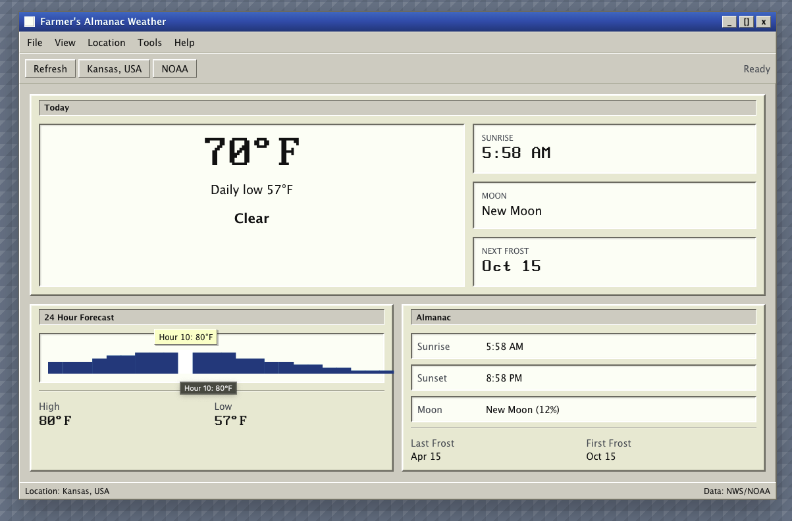

# Farmer's Almanac Weather

A Qt-inspired weather almanac built with Next.js. It shows current conditions, a 24-hour temperature forecast, sunrise and sunset, moon phase, and frost dates.



## Features

- Draggable desktop-style weather window
- Clickable File, View, Location, Tools, and Help menus
- ZIP code or address-based location changes
- Hoverable 24-hour forecast bars with temperature labels
- NOAA/NWS-backed weather data

## Getting Started

Install dependencies and run the development server:

```bash
pnpm install
pnpm dev
```

Open [http://localhost:3000](http://localhost:3000) in your browser.

## Checks

```bash
pnpm test -- --run
pnpm build
```
